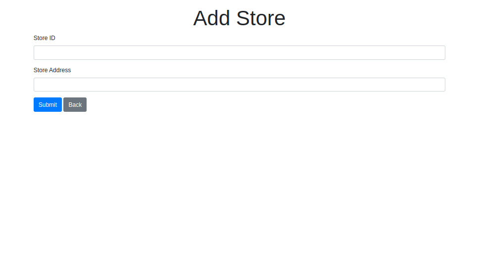

# Store Locator App

Node JS App.
1. [GeoJSON API use](https://mongoosejs.com/docs/geojson.html).
2. [MapBox API use](https://account.mapbox.com/).
3. [Map Quest API use](https://developer.mapquest.com/).
4. [Node geo-coder use](https://www.npmjs.com/package/node-geocoder).
## Node JS Setup

To run this project, you will need to add the following environment variables to your .env file in config folder.

`MONGO_URI`

`GEOCODER_API_KEY`
## Demo App

('')
('')
